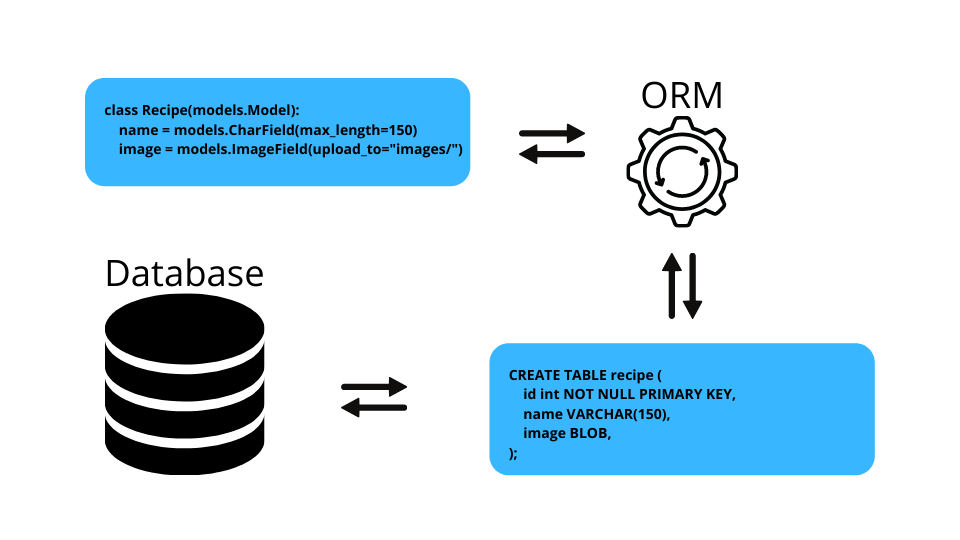

# Django

## Introduction
>The Django Framework is build upon the ***MVC*** Design Pattern. It is one of the most famous design pattern that is used many other frameworks and easy to implement.
>The ***MVC*** stands for Model-View-Controller, where all these entities communicate with each other in terms of data and also loosely coupled. Each entity knows its role best in terms of seperation of concerns.

## Data Models
***Models*** in django is a great abstration in django framework. When we *query* the database we dont directly take data from the database as we use **SQL language** that is also an abstraction to perfrom CRUD on db schema.
But python build more abstraction for us to have so that we don't have to bother about the complex sql queries as well, mainly as a developer we can focus on the project goal.
> So the point of the matter is that What is ***ORM***?
> The **ORM** stands for Object Relational Mapper that is used by django to map the django objects to the SQL to perform the CRUD to database schema.

***What are Migrations in Django?***
> Migrations is a method in Django that is used to **"apply the changes based on the changes that you have made in your models"**. For instance if you change add a field, or delete a specific model or other operations related to CRUD.
> So we can easily focus on this by focusing on the simple flow of migration procedures that is mostly done.

**Example**
If i make any changes in the model, that would surely reflect on to our database but in order to do that, after making changes we have to create new migrations on the queue that fill applied when we migrate the following changes

**General Steps**
1. Make changes in the model
2. makemigrations
3. migrate
 
So in general, after making the changes in model, you make new migrations, that will be migrated by you to apply the changes to the database.

   
 
